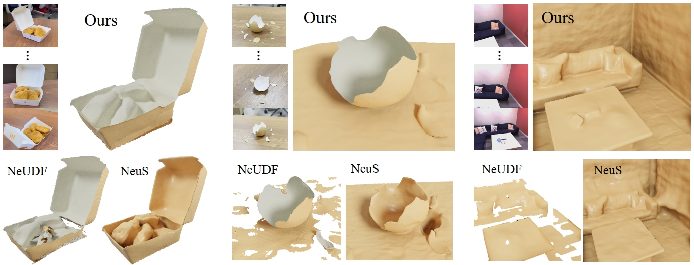

<p align="center" />
<h1 align="center">Learning Unsigned Distance Functions from Multi-view Images with Volume Rendering Priors </h1>

<p align="center">
    <a href="https://wen-yuan-zhang.github.io/"><strong>Wenyuan Zhang</strong></a>
    ·
    <strong>Kanle Shi</strong></a>
    ·
    <a href="https://yushen-liu.github.io/"><strong>Yu-Shen Liu</strong></a>
    ·
    <a href="https://h312h.github.io/"><strong>Zhizhong Han</strong></a>
</p>
<h2 align="center">ECCV 2024</h2>
<h3 align="center"><a href="https://arxiv.org/abs/2407.16396">Paper</a> | <a href="https://wen-yuan-zhang.github.io/VolumeRenderingPriors/">Project Page</a></h3>
<div align="center"></div>
<p align="center">
    
</p>

We introduce volume rendering priors to infer UDFs from multi-view images. Our prior can be learned in a data-driven manner, which provides a novel perspective to recover geometry with prior knowledge through volume rendering.

# Setup

## Installation

Clone the repository and create an anaconda environment called vrpudf using
```shell
git clone git@github.com:wen-yuan-zhang/VolumeRenderingPriors.git
cd VolumeRenderingPriors

conda create -n vrpudf python=3.10
conda activate vrpudf

conda install pytorch=1.13.0 torchvision=0.14.0 cudatoolkit=11.7 -c pytorch
conda install cudatoolkit-dev=11.7 -c conda-forge

pip install -r requirements.txt
```

We leverage [MeshUDF](https://github.com/cvlab-epfl/MeshUDF) to extract mesh from the learned UDF field, which is the same as [NeuralUDF](https://github.com/xxlong0/NeuralUDF). To compile the custom version for your system, please run:
```shell
cd custom_mc
python setup.py build_ext --inplace
cd ..
```

## Dataset
For **DTU** dataset, we use the same one as NeuS. You can download DTU dataset from the repo of [NeuS](https://github.com/Totoro97/NeuS).

For **Deepfashion3D** dataset, we use the same one as NeuralUDF. You can download the GT images and pointclouds from the repo of [NeuralUDF](https://github.com/xxlong0/NeuralUDF).

For **Replica** dataset, we processed it into the same data format as NeRF. You can download the ground truths from [here](https://drive.google.com/drive/folders/1g89U5UXH_akqJ3sjhY1GaYfwqy6CA8SA?usp=sharing).

For **real-captured** dataset, the two scenes that used in NeUDF can be downloaded from the repo of [NeUDF](https://github.com/IGLICT/NeUDF). The other four scenes that captured by ourself can be downloaded from [here]() (coming soon).

# Learning Volume Rendering Priors
## Preparing datasets
We select a car model from [ShapeNet](https://shapenet.org/) and a cloth model from [DeepFashion](https://mmlab.ie.cuhk.edu.hk/projects/DeepFashion.html) to contruct our training dataset. Given a model which is pre-normalized in the cube of $[-1,1]^3$, we first transform the model into a watertight one and sample GT SDFs at a resolution of 1024, using [point-cloud-utils](https://github.com/fwilliams/point-cloud-utils). Then we use Blender to render multi-view depth maps as training objectives. The prior datasets have been provided in `data/prior_datasets`. To use the scipts, first install [Blender](https://download.blender.org/release/Blender2.90/) and add the Blender directory into the executable path.
```shell
export PATH=$YOUR_PATH_TO/blender-2.90.0-linux64:$PATH
```
Then sample GT SDFs and produce GT depth maps and camera infos using the following script.
```shell
cd data/prior_datasets/shapenet_02958343
python sample_sdf.py
blender --background --python render_blender.py -- --output_folder images model_watertight.obj
cd ../df3d_1
python sample_sdf.py
blender --background --python render_blender.py -- --output_folder images model_watertight.obj
```

## Training Priors
Use the following scipt to train volume rendering priors.
```shell
python exp_runner.py --conf confs/shapenet/shapenet.conf --mode train_mlp
```


# Generalizing Priors to UDF Inference

## Training UDF
We provide example commands for training DTU, Replica, and real-captured datasets as follows:
```shell
# DTU scan24
python exp_runner.py --conf confs/dtu/womask.conf --mode train_udf_color_wodepth --case dtu_scan24

# DeepFashion 30
python exp_runner.py --conf confs/deepfashion3d/deepfashion3d.conf --mode train_udf_color_wodepth --case 30

# Replica room0
python exp_runner.py --conf confs/replica/replica.conf --mode train_udf_color_wodepth --case room0

# real-captured fan
python exp_runner.py --conf confs/real_captured/real_captured.conf --mode train_udf_color_wodepth --case fan
```

The `mode` argument provides different training manners. You can set different training modes to turn on or turn off different supervisions.

<details>
<summary><span style="font-weight: bold;">Optional Arguments for "--mode"</span></summary>

  #### --mode train_udf
  Train UDF network with rgb and depth supervisions. 
  #### --mode train_udf_color
  Train both UDF network and color network with rgb and depth supervisions. 
  #### --mode train_udf_color_wodepth
  Train both UDF network and color network with rgb supervisions. Default setting. To align with other UDF baselines, please keep this setting.

</details>
<br>

## Extracting mesh
To extract the surfaces from trained model, use the following script:
```shell
# DTU scan24
python exp_runner.py --conf confs/dtu/womask.conf --mode train_udf_color_wodepth_validate_mesh --case_name dtu_scan24 --is_continue 

# Deepfashion 30
python exp_runner.py --conf confs/deepfashion3d/deepfashion3d.conf --mode train_udf_color_wodepth_validate_mesh --case_name 30 --is_continue

# Replica room0
python exp_runner.py --conf confs/replica/room0.conf --mode train_udf_color_wodepth_validate_mesh --is_continue

# real-captured fan
python exp_runner.py --conf confs/real_captured/real_captured.conf --mode train_udf_color_wodepth_validate_mesh --case_name fan --is_continue
```


# Evaluation
To evaluate the extracted meshes and calculate numerical results, use the following script. The postprocessed meshes and the evaluated numerical results will be saved under `$mesh_dir/udf_meshes_clean/`.
```shell
cd evaluation/

# DTU
python eval_dtu.py --gt_dir $PATH_TO_GT --data_dir $PATH_TO_DATA --mesh_dir $PATH_TO_EXTRACTED_MESH --scan $CASE_NAME --mesh_name $MESH_NAME
# example
python eval_dtu.py --gt_dir ../data/DTU_GTpoints --data_dir ../data/DTU --mesh_dir ../log/DTU/dtu_scan24/udf_meshes --scan 24

# Deepfashion
python eval_deepfashion.py --gt_dir ../data/deepfashion3d_gt_pc --data_dir ../data/deepfashion3d --mesh_dir ../log/deepfashion3d/30/udf_meshes --scan 30

# Replica
python eval_replica.py --gt_dir ../data/Replica/gt_meshes/ --data_dir ../data/Replica --mesh_dir ../log/replica/room0/udf_meshes/ --scan room0
```


# Pretrained Meshes
We provide the pretrained meshes of all the three datasets. If you are willing to use these meshes, please download them from [here](https://drive.google.com/drive/folders/1oJ5qMVkb-CdVbGLNmP5f7LZRfop8lrpv?usp=sharing).

# Citation
If you find our code or paper useful, please consider citing
```bibtex
@article{zhang2024learning,
      title={Learning Unsigned Distance Functions from Multi-view Images with Volume Rendering Priors},
      author={Zhang, Wenyuan and Shi, Kanle and Liu, Yu-Shen and Han, Zhizhong},
      journal={European Conference on Computer Vision},
      year={2024},
      organization={Springer}
    }
```

# Acknowledgement
This project is built upon [NeuS](https://github.com/Totoro97/NeuS). The mesh extraction and evaluation scipts are partially borrowed from [MeshUDF](https://github.com/cvlab-epfl/MeshUDF) and [NeuralUDF](https://github.com/xxlong0/NeuralUDF). Thanks for these great projects.